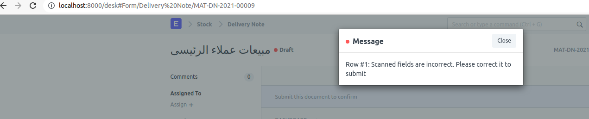
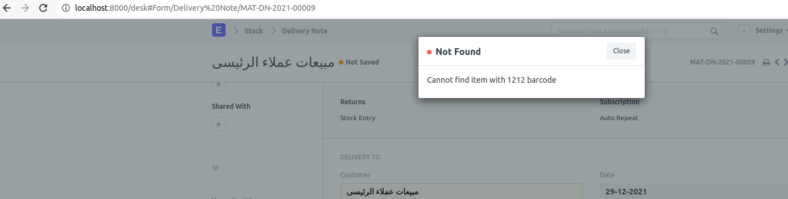
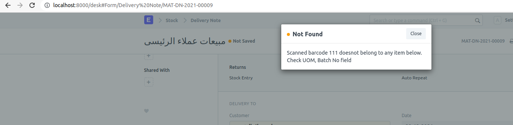
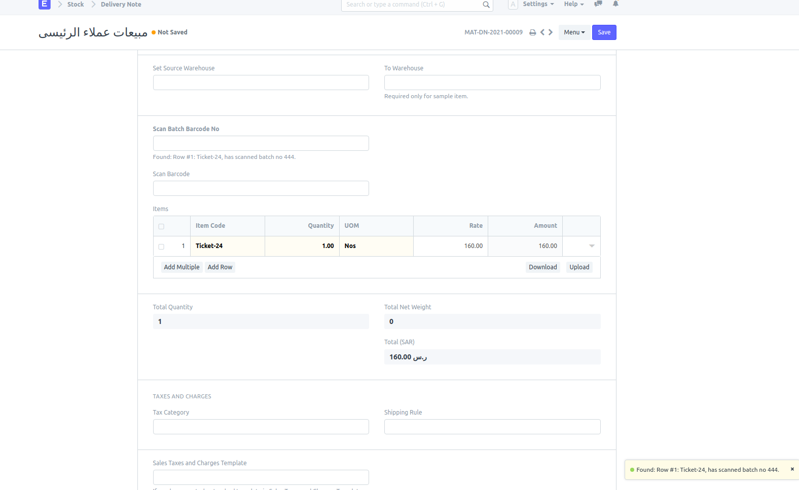

## Almofa

Customization for Almofa

[1]To bypass batchbarcode for delivery item, ensure batch_no field is empty. 
Below popup will appear on submit when batch_no field of delivery child item doesn't match scanned_batch_no_cf OR scanned_uom_cf

[A] scanned batch barcode is not found in system

[B] scanned batch barcode is found in system , but doesn't match UOM or batch_no of delivery items

[C] Matched with UOM and batch_no

#### License

MIT

